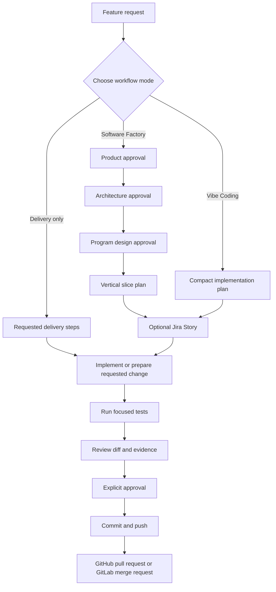

# Feature Lifecycle

A Codex skill for taking software changes from an initial idea to tested,
reviewed, and deliverable code.

It supports structured feature planning, optional Jira integration, local Git
work, automated tests, and GitHub pull requests or GitLab merge requests.

> This repository contains the skill itself. The workflow can be used inside
> Codex for other software projects.

## What it does

Feature Lifecycle helps you:

- clarify a feature request
- choose an appropriate delivery mode
- create an optional Jira Story
- plan work in vertical slices
- create safe feature branches
- implement and test changes
- review diffs before committing
- push changes and create a GitHub pull request or GitLab merge request

Jira is optional. The hosting provider is detected from the Git remote URL by
default. GitHub and GitLab are supported for software delivery.

## Workflow at a glance



## Workflow modes

### Software Factory

Use this mode for larger, cross-cutting, risky, or uncertain changes.

It uses four approval gates:

1. Product
2. Architecture
3. Program design
4. Vertical slice plan

Each vertical slice should result in a working and testable increment.

### Vibe Coding

Use this mode for clearly scoped, lower-risk changes.

The workflow uses:

1. A compact implementation plan
2. One approval
3. Implementation
4. Tests
5. Review and delivery

### Delivery only

Use this mode when you only need specific delivery work, such as:

- preparing a branch
- running tests
- creating a commit
- pushing changes
- creating a merge request

No product or architecture planning is added.

## Safety principles

The skill is intentionally approval-driven.

It does not automatically:

- create Jira issues
- create branches
- create commits
- push changes
- create merge requests

Before a commit, it shows:

- affected files
- the actual diff
- test results
- the proposed commit message

Before pushing or creating a merge request, it shows:

- the complete branch diff
- final test evidence
- Definition-of-Done status
- planned merge-request content

External delivery requires explicit approval.

## Configuration

Team-wide defaults belong in:

```text
.feature-workflow.yaml
```

Personal or local overrides belong in:

```text
.feature-workflow.local.yaml
```

The local file should not be committed and must not contain secrets.

A minimal configuration can look like this:

```yaml
schema_version: 1

git:
  provider: auto
  base_branch:
    strategy: provider_default

workflow:
  mode_selection: always_ask
  jira_creation_after: program_design

jira:
  enabled: true
  project:
    strategy: context_or_ask
    key: null
  issue_type: Story
  content_language: de
```

To use the workflow without Jira:

```yaml
jira:
  enabled: false
```

When Jira is disabled, the workflow skips Jira setup, issue creation, status
transitions, and Jira linking.

The default `git.provider: auto` detects GitHub or GitLab from the remote URL.
Use `github` or `gitlab` explicitly for enterprise or self-hosted setups when
automatic detection cannot identify the provider reliably.

## Language conventions

By default:

- Jira content is written in German
- branches are named in English
- commit messages are written in English
- GitHub pull-request and GitLab merge-request titles and descriptions are written in English

These conventions can be adjusted through the configuration.

## Repository contents

```text
SKILL.md                         Main skill instructions
README.md                        This documentation
VERSION                          Skill version
agents/openai.yaml               Skill metadata
references/                      Detailed workflow documentation
evals/                           Fixtures, mocks, and behavior scenarios
```

Important reference files include:

- `references/software-factory.md`
- `references/vibe-coding.md`
- `references/delivery-only.md`
- `references/config-schema.md`
- `references/gitlab-delivery.md` (GitHub and GitLab delivery)
- `references/recovery-and-resume.md`

## Getting started

Install or make the skill available to Codex, then ask for help with a feature
or delivery task.

Examples:

```text
Help me plan a new feature.
```

```text
Use the delivery-only workflow and run the relevant tests.
```

```text
Explain the available workflow modes.
```

```text
Help me configure Jira for this repository.
```

The skill will inspect the repository instructions and configuration before
taking action.

## Design goals

Feature Lifecycle is designed to be:

- explicit instead of assumption-driven
- safe around Git and external systems
- lightweight for small changes
- structured for complex work
- test-oriented
- resumable across sessions

## License

Add the project license here before publishing if this repository will be
distributed publicly.
